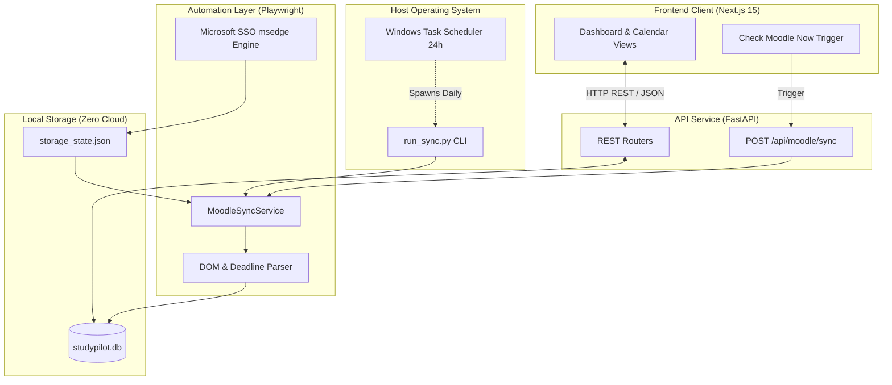

# Study Pilot 🧭

**A Local-First Academic Workflow Assistant & University LMS Automation Engine**

Study Pilot connects directly with university Moodle instances, automatically monitors courses and deadlines, orchestrates local development workspaces, and streamlines academic deliverables—engineered with a zero-cloud, zero-recurring-cost local architecture.

[](#author--contact)
[](LICENSE.md)
[](https://www.python.org/)
[](https://fastapi.tiangolo.com/)
[](https://nextjs.org/)
[](https://www.typescriptlang.org/)
[](https://sqlmodel.tiangolo.com/)

[GitHub Repository](https://github.com/maimoona-qasmi/study-pilot) • [System Architecture](docs/architecture.md) • [Engineering Decisions](docs/decisions.md) • [Changelog](CHANGELOG.md) • [Author LinkedIn](https://www.linkedin.com/in/maimoona-qasmi)

---

## Overview

### What is Study Pilot?
Study Pilot is a personal desktop academic assistant designed to solve a core problem faced by university students in computer science and engineering: **fragmented course deliverables and opaque deadlines**.

University Learning Management Systems (such as Moodle / SHU-LMS) often suffer from disjointed navigation, buried assignment submission portals, lack of deadline distinction between reference material and graded tasks, and manual document formatting overhead. Study Pilot connects to the LMS as a source of truth, synchronizes course requirements, isolates actionable deadlines, and sets up reproducible local workspaces for coding, simulation, and report generation.

### Who is it for?
Undergraduate university students in Computer Science, Software Engineering, and Electrical Engineering who manage multiple concurrent technical workflows: programming lab tasks, circuit simulations, and academic reports.

### Why I Built It
I built Study Pilot to:
1. Eliminate missed deadlines by creating an automated, unified audit trail of real university assignments.
2. Build an end-to-end full-stack system combining modern web technologies (Next.js 15 App Router, TypeScript, Tailwind) with resilient backend systems (Python, FastAPI, SQLModel, Playwright, Windows Task Scheduler).
3. Solve complex real-world engineering hurdles: single sign-on (Microsoft SSO) in automated browser contexts, dynamic DOM parsing across Moodle versions, and resilient local persistence with strict zero-cloud privacy.

---

## Features

### Implemented (✅ Completed & Verified)
- **Zero-Credential Microsoft SSO Engine**: Integrates Playwright with native Microsoft Edge (`channel="msedge"`) and Windows Credential Manager flags. Authenticates through university Single Sign-On (including MFA) without ever capturing or storing plain-text passwords.
- **Session Health Diagnostics**: Detects session expiry gracefully, automatically notifies the frontend, and enables fast re-authentication.
- **Automated Semester Partitioning**: Dynamic heuristic crawler that extracts active semester courses (e.g., Spring 2026) and cleanly archives past semesters (e.g., Fall 2025) based on institutional course code formats.
- **Activity Classification & Strict Deadline Extraction**: Indexes all course materials into `MoodleActivity` models (`assignment`, `quiz`, `resource`, `file`, `forum`, `attendance`). Extracts due dates from `.submissionstatustable` and isolates items with strict deadlines from general course files.
- **Dual Execution Engine**:
  - *Interactive*: One-click "Check Moodle Now" from the web UI with live REST polling and audit updates.
  - *Autonomous*: Standalone Python CLI (`run_sync.py`) registered via Windows Task Scheduler to run silently once every 24 hours without requiring the web server or browser to be open.
- **Audited Sync Runs**: Persists every synchronization attempt in SQLite (`SyncRun` and `AgentActivityLog`), tracking items discovered, execution duration, and errors.
- **Executive Web Dashboard**: Responsive dark UI featuring statistics cards, active vs archived course cards, activity filters, and a dedicated deadline calendar.

### In Progress (🚧 Phase 2)
- **Academic Workflow Engine**: Course-specific workflow bindings (e.g., `CSC-103 Object Oriented Programming` -> C++ workspace; `ELE-205 Digital Logic Design` -> Circuit simulation workspace; `ENG-102 Expository Writing` -> Document workspace).
- **Workspace Generator**: Automated scaffolding of structured project folders (`data/workspaces/{course_code}/{activity_slug}/`) containing `src/`, `evidence/`, `output/`, and `workspace.json`.
- **Native OS Launchers**: Direct one-click "Open in VS Code" (`code <path>`) and "Open in Explorer" (`explorer.exe <path>`) from the browser.
- **University Report Generator (`python-docx`)**: Local generation of standardized university lab reports with cover pages, question prompts, monospaced code blocks, and embedded execution screenshots.

### Planned (⬜ Future Roadmap)
- **Phase 3 — Local AI Verification**: Integration with a local LLM (e.g. Ollama) for zero-cost code review, rubric analysis, and verification of lab task requirements before submission.
- **Phase 4 — Review & Staging Pipeline**: Human-in-the-loop review dashboard to inspect generated deliverables before automated Moodle upload.

---

## Engineering Highlights

| Architectural Area | Implementation Details |
| :--- | :--- |
| **Authentication & SSO** | Leverages Microsoft Edge with Windows Web Account Manager (WAM) flags (`msSingleSignOnOSForPrimaryAccountIsShared`). Eliminates the common `ProcessSingleton lock error 32` by creating an isolated persistent profile directory under `data/moodle_auth/edge_profile/`. |
| **Architecture Decoupling** | The core crawler engine (`MoodleSyncService`) is 100% decoupled from the web server. It is executed identically by FastAPI background tasks and by the standalone Windows Task Scheduler CLI, eliminating code divergence. |
| **Data Modeling** | Utilizes **SQLModel** (Pydantic + SQLAlchemy) for strict type safety and schema validation. Database sessions use `expire_on_commit=False` to prevent `DetachedInstanceError` across asynchronous background threads. |
| **Zero-Cost Constraint** | Engineered under a strict \$0/month infrastructure mandate: embedded SQLite, headless local browser automation, and local file generators. Zero paid APIs, no external cloud dependencies, and complete data privacy. |
| **Defensive Scraping** | Reverse-engineers Moodle 4 DOM layouts dynamically; targets `/my/courses.php` to avoid idiosyncratic dashboard block configurations across student accounts. |
| **Full-Stack Typing** | Strict TypeScript definitions on the frontend mirroring backend Pydantic models, ensuring runtime consistency and developer ergonomics. |

---

## Tech Stack

### Frontend
- **Framework**: Next.js 15.5 (App Router, Server & Client Components)
- **Language**: TypeScript 5.x
- **Styling**: Tailwind CSS, PostCSS
- **Icons**: Lucide React
- **Data Fetching**: Custom typed REST client (`src/lib/api.ts`) with native fetch and live state polling

### Backend
- **Framework**: FastAPI 0.115+
- **Language**: Python 3.14 (64-bit Windows)
- **Database & ORM**: SQLite, SQLModel (SQLAlchemy ORM + Pydantic)
- **Browser Automation**: Playwright (Microsoft Edge channel)
- **Server**: Uvicorn ASGI

### Automation & OS Integration
- **Scheduler**: Windows Task Scheduler (via PowerShell setup script)
- **CLI**: Standalone Python runner (`run_sync.py`)
- **Testing**: Pytest (database model tests, API integration tests)
- **Version Control**: Git, Conventional Commits

---

## Architecture

Study Pilot follows a clean, layered architecture separating user presentation, API coordination, headless automation, and local persistence.



*For an in-depth breakdown of component interactions and data flows, see [docs/architecture.md](docs/architecture.md).*

---

## Engineering Decisions

Key technical decisions and trade-offs are documented as Architectural Decision Records (ADRs) in [`docs/decisions.md`](docs/decisions.md):

1. **[ADR 01: Windows Task Scheduler vs In-Process Scheduler](docs/decisions.md#adr-01-windows-task-scheduler-as-primary-daily-scheduler-vs-in-process-apscheduler)** — Selected native OS scheduling to guarantee daily checks even when the web server is closed.
2. **[ADR 02: Playwright Microsoft Edge Channel vs Chromium](docs/decisions.md#adr-02-playwright-with-microsoft-edge-channel--windows-sso-flags-vs-standard-chromium)** — Leveraged Windows Credential Manager SSO flags to authenticate without handling or storing user passwords.
3. **[ADR 03: Unified Sync Engine Decoupled from Web Server](docs/decisions.md#adr-03-unified-sync-engine-decoupled-from-presentation-layer)** — Single core service class shared between FastAPI endpoints and CLI scripts.
4. **[ADR 04: Generalized MoodleActivity Schema](docs/decisions.md#adr-04-generalized-moodleactivity-schema-with-strict-deadline-segregation)** — Unified data model with indexed `has_deadline` and `due_date` fields to cleanly separate actionable deadlines from general files.
5. **[ADR 05: Local-First Zero-Cost Architecture](docs/decisions.md#adr-05-local-first-zero-cost-architecture-sqlite--sqlmodel--nextjs)** — Native SQLite + local execution providing zero recurring costs and absolute student data privacy.

---

## Real Engineering Challenges & Solutions

### Challenge 1: Microsoft SSO in Automated Browsers without Credential Storage
- **Problem**: University authentication requires Microsoft Single Sign-On with 2FA/MFA. Prompting the user for passwords violates security standards, while standard headless Chromium fails corporate device trust checks.
- **Investigation**: Standard Chromium profiles do not interface with Windows Web Account Manager (WAM). Direct attachment to the user's running Edge profile caused `ProcessSingleton lock error 32`.
- **Solution**: Configured Playwright with `channel="msedge"` targeting a dedicated persistent user data directory (`data/moodle_auth/edge_profile/`) and explicit SSO flags (`--enable-features=msSingleSignOnOSForPrimaryAccountIsShared,msImplicitSignIn`).
- **Result**: Students on Windows authenticate seamlessly with one click; session state is captured safely to `storage_state.json` without storing passwords.

### Challenge 2: Moodle 4 Dynamic Navigation & Course Partitioning
- **Problem**: Default Moodle `/my/` dashboards use personalized block arrangements that differ per student, making CSS selectors unreliable. Additionally, past semester courses remained mixed with active courses.
- **Investigation**: Inspected raw DOM across multiple LMS pages. Discovered `/my/courses.php` presents an unfragmented course listing. Course short names also encode semester terms (e.g. `2601-...` for Spring 2026 vs `2503-...` for Fall 2025).
- **Solution**: Shifted the crawler entry point to `/my/courses.php`. Built a semester extraction regex that determines the highest active semester ID, automatically tagging older courses as archived.
- **Result**: Successfully categorized 12 live courses (6 active Spring 2026 courses, 6 archived Fall 2025 courses) and 141 activities with 100% selector reliability.

### Challenge 3: SQLite Session Detachment with Background Tasks
- **Problem**: Triggering syncs via FastAPI background tasks led to `DetachedInstanceError` when accessing ORM model attributes after session commit.
- **Investigation**: SQLModel/SQLAlchemy expires object attributes upon `session.commit()` by default, causing subsequent attribute lookups outside the transaction context to fail.
- **Solution**: Configured database session instances with `expire_on_commit=False` across background workers, and passed detached ID primitives rather than live entity pointers to async tasks.
- **Result**: Zero thread collisions or detached instance errors during concurrent syncs.

---

## AI-Assisted Development Philosophy

Study Pilot was developed using AI assistance (Google Gemini / DeepMind tools) as an accelerator. 

**My approach as an engineer:**
- **Architecture & Direction**: I define the project boundaries, system requirements, zero-cost constraints, and technical architecture.
- **Code Review & Quality Control**: Every piece of AI-generated boilerplate or suggestion is rigorously inspected, refactored, and tested against real LMS endpoints.
- **Problem Solving & Debugging**: When automated tools encounter edge cases (such as Windows file locks, Moodle DOM quirks, or async session errors), I lead the root-cause analysis, design the fix, and verify the outcome.
- **Accountability**: AI is an engineering tool; I am the author and engineer solely responsible for the architecture, security, and stability of this application.

---

## UI Preview

Visual previews of the Study Pilot desktop web application with live university data:

| View | Description |
| :--- | :--- |
| **Executive Dashboard** | High-level metrics, active course summaries, upcoming deadlines, and live sync trigger. |
| **Course Registry** | Active Spring 2026 courses partitioned from archived Fall 2025 courses. |
| **Activity Database** | Filterable table of 141 activities with status dropdowns, deadline indicators, and Moodle links. |
| **Strict Calendar** | Chronological deadline schedule displaying only items with confirmed due dates. |
| **SSO Settings** | Microsoft Edge connection status, session health indicator, and interactive login launcher. |

*(Sample interface screenshots are maintained in [`screenshots/`](screenshots/README.md)).*

---

## Local Setup & Quick Start

### Prerequisites
- Windows 10 or 11
- Python 3.12+ (Python 3.14 recommended)
- Node.js 20+ (Node.js 24 recommended)
- Microsoft Edge installed (standard on Windows)

### 1. Clone & Configure Environment
```powershell
git clone https://github.com/maimoona-qasmi/study-pilot.git
cd "study-pilot"
cp .env.example .env
```

### 2. Backend Setup
```powershell
cd backend
python -m venv .venv
.\.venv\Scripts\Activate.ps1
pip install -r requirements.txt
playwright install msedge
```

### 3. Frontend Setup
```powershell
cd ..\frontend
npm install
```

### 4. Run Development Servers
From the repository root:
```powershell
.\run_dev.ps1
```
- **Web Dashboard**: [http://localhost:3000](http://localhost:3000)
- **FastAPI Documentation**: [http://localhost:8000/docs](http://localhost:8000/docs)

### 5. Automated Tests
```powershell
.\backend\.venv\Scripts\pytest
cd frontend && npm run build
```

---

## Author & Contact

**Maimoona Qasmi**  
Undergraduate Computer Science Student  
- **GitHub**: [@maimoona-qasmi](https://github.com/maimoona-qasmi)  
- **LinkedIn**: [linkedin.com/in/maimoona-qasmi](https://www.linkedin.com/in/maimoona-qasmi)  
- **Email**: `maimoonaqasmi4@gmail.com`

---

## License & Intellectual Property

**Copyright © 2026 Maimoona Qasmi. All rights reserved.**

This repository and its contents are provided strictly for **viewing and evaluation purposes by prospective employers, recruiters, and academic evaluators**. 

No permission is granted to copy, reproduce, modify, distribute, publish, sublicense, sell, or reuse any portion of this project or its source code without prior written authorization from the author. See [LICENSE.md](LICENSE.md) for full terms.
