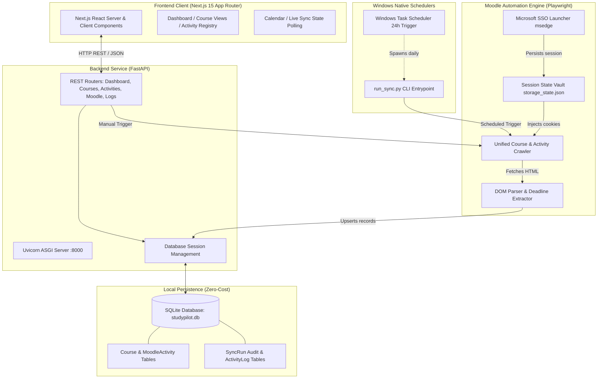

# Study Pilot — System Architecture

This document details the architectural topology, component boundaries, execution flows, and data lifecycle of **Study Pilot**.

---

## 1. High-Level Architectural Diagram

Study Pilot utilizes a decoupled client-server architecture designed for local Windows execution with zero external cloud dependencies.



---

## 2. Component Breakdown

### A. Frontend Layer (Next.js 15 & React 19)
- **Framework**: Next.js 15 App Router with TypeScript.
- **Styling**: Tailwind CSS with custom slate-950 dark theme.
- **State & Data Fetching**: Lightweight native REST polling via custom typed client (`src/lib/api.ts`). Zero heavy external dependencies (no Redux, TanStack Query, or SWR required in Phase 1).
- **Core Views**:
  - `Dashboard (/)`: Key metric cards, quick-sync trigger, session health status, and upcoming priority items.
  - `Courses (/courses)`: Active semester courses vs archived past semesters, with direct Moodle navigation.
  - `Activities (/activities)`: Filterable multi-facet table (course, type, deadline status) with status overrides.
  - `Calendar (/calendar)`: Time-sorted view strictly filtering activities with verifiable deadlines.
  - `Activity Log (/activity)`: Granular chronological timeline of agent operations and crawler executions.
  - `Settings (/settings)`: Moodle base URL configuration, interactive SSO login launcher, and real-time session verification.

### B. Backend Layer (FastAPI & SQLModel)
- **ASGI Server**: Uvicorn running on `127.0.0.1:8000`.
- **Data Modeling**: `SQLModel`, fusing SQLAlchemy's relational ORM with Pydantic's runtime validation.
- **Session Handling**: Dependency injection via `get_session()` ensuring transaction isolation. Explicit `expire_on_commit=False` configuration prevents detached model errors when background tasks execute concurrently.
- **API Routing**:
  - `/api/dashboard`: Aggregated metrics and deadline counts.
  - `/api/courses`: Course querying, filtering, and workflow binding.
  - `/api/activities`: Multi-criteria querying and status updates.
  - `/api/moodle`: Manual sync trigger, live status polling, and sync run history.
  - `/api/settings`: Key-value configuration store and session status checks.

### C. Moodle Crawler Engine (Playwright with Microsoft Edge)
- **Authentication Strategy**:
  - Rather than storing brittle plain-text passwords or attempting to spoof complex MFA flows, Study Pilot uses Playwright's `channel="msedge"` to spawn an authentic Microsoft Edge browser instance.
  - Incorporates native Windows Single Sign-On flags:
    `--enable-features=msSingleSignOnOSForPrimaryAccountIsShared,msImplicitSignIn`
  - Leverages Windows Credential Manager integration so university students on Windows machines are frequently logged in with a single click.
  - Successful sessions are captured to `data/moodle_auth/storage_state.json`.
- **Parsing Engine (`sync_service.py`)**:
  - **Dynamic Course Discovery**: Targets `/my/courses.php` to bypass personalized Moodle 4 dashboard block layouts.
  - **Semester Partitioning**: Course short names encode university semester IDs (e.g. `2601-...` = Spring 2026 vs `2503-...` = Fall 2025). The engine dynamically detects the latest semester ID and automatically designates older courses as archived.
  - **Activity Extraction**: Navigates into each course module, classifying activities (`assignment`, `quiz`, `resource`, `file`, `forum`, `attendance`).
  - **Strict Deadline Verification**: Inspects `.submissionstatustable` elements to parse due dates and detect whether submissions have already been made (`"Submitted for grading"` vs `"No submission"`).

### D. Dual-Path Execution Model
1. **Interactive Path (FastAPI Endpoint)**:
   - User triggers "Check Moodle Now" on the frontend.
   - FastAPI launches the sync task asynchronously in a background thread.
   - Frontend polls `/api/moodle/sync/status` to display a live progress spinner and updates.
2. **Autonomous Path (Windows Task Scheduler CLI)**:
   - `backend/run_sync.py` executes standalone:
     ```powershell
     python backend/run_sync.py sync --trigger scheduled
     ```
   - Scheduled via Windows Task Scheduler once every 24 hours.
   - Operates independently of whether Next.js or FastAPI are running.
   - Both paths call the exact same `MoodleSyncService.sync()` engine, preventing code duplication.

---

## 3. Data Flow & Security Boundaries

```
[Moodle LMS (lms.shu.edu.pk)]
       │
       │ HTTPS (Playwright Session)
       ▼
[Local Host Boundary (Windows)]
┌─────────────────────────────────────────────────────────────┐
│ data/moodle_auth/storage_state.json (Gitignored Session)    │
│                       │                                     │
│                       ▼                                     │
│ backend/app/moodle/sync_service.py                          │
│                       │                                     │
│                       ▼                                     │
│ data/studypilot.db (SQLite Local Database)                  │
│                       ▲                                     │
│                       │ SQLModel ORM                        │
│ backend/app/api/ (FastAPI on 127.0.0.1:8000)                │
│                       ▲                                     │
│                       │ REST API (JSON)                     │
│ frontend/ (Next.js on 127.0.0.1:3000)                       │
└─────────────────────────────────────────────────────────────┘
```

- **Credential Isolation**: Passwords are never collected or stored.
- **Network Scope**: The backend and frontend bind only to `127.0.0.1`.
- **Zero Cloud Leakage**: No user records, course syllabi, or submission metadata leave the local workstation.
