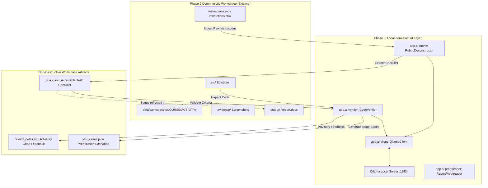

# Phase 3 Architectural Specification: Local AI-Assisted Academic Workflow

> [!NOTE]
> **Status**: Architectural Specification (Planning Mode)  
> **Target Phase**: Phase 3  
> **Prerequisites**: Phase 1 (Live Moodle Automation) and Phase 2 (Local Workspace Engine & Document Generator) completed and verified.

---

## 1. Objectives & Principles

Phase 3 introduces intelligent, automated academic assistance layered seamlessly on top of Phase 2's deterministic workspaces.

### Core Tenets
1. **Zero Recurring Cost**: Strictly local-first execution using open-weights models via **Ollama** (e.g. `qwen2.5-coder:7b`, `llama3.2:3b`, or `deepseek-r1:8b`). Zero OpenAI/Anthropic/Gemini paid API keys required.
2. **Deterministic Fallback**: If Ollama or the local model is offline, Study Pilot continues to function with 100% of Phase 2 capabilities (workspace generation, launchers, and DOCX generation). AI is strictly an enhancement, never a hard dependency.
3. **Student Authorship & Integrity**: The AI acts as an advisory reviewer and task breaker, not an autonomous agent that silently writes or replaces the student's solution. No user files in `src/` are ever modified without explicit confirmation.
4. **Complete Data Privacy**: University assignments, student solutions, and course notes remain entirely on `127.0.0.1`.

---

## 2. Component Architecture



---

## 3. Subsystem Breakdown

### A. Local LLM Bridge (`backend/app/ai/client.py`)
- Communicates with Ollama's local REST API at `http://127.0.0.1:11434/api/generate` and `/api/tags`.
- Features:
  - **Health Diagnostic**: Detects if Ollama is running and lists installed models.
  - **Model Selection**: Defaults to lightweight coding models (`qwen2.5-coder:7b` or `deepseek-r1:8b`), falling back to general models (`llama3.2:3b`).
  - **Structured JSON Mode**: Enforces `format="json"` for deterministic machine-readable outputs.

### B. Rubric & Instruction Deconstructor (`backend/app/ai/rubric.py`)
- Consumes `instructions.md` stored in the activity workspace.
- Produces `tasks.json` in the workspace folder:
  ```json
  {
    "objectives": [
      {
        "id": "task_1",
        "title": "Design Student Class",
        "description": "Attributes: name, roll_number, marks (array of 5 subjects)",
        "completed": false
      },
      {
        "id": "task_2",
        "title": "Implement Member Functions",
        "description": "input_details(), calculate_grade(), display_marksheet()",
        "completed": false
      }
    ],
    "technical_constraints": [
      "Use dynamic memory allocation with new and delete",
      "Implement proper destructor"
    ],
    "expected_deliverables": [
      "C++ source file (.cpp)",
      "Execution output screenshot"
    ]
  }
  ```

### C. Code Verifier & Requirement Checker (`backend/app/ai/verifier.py`)
- Reads code files in `src/` and compares them against `tasks.json`.
- Non-destructive operation:
  - Checks for missing requirements, syntax pitfalls, unhandled edge cases, and memory leaks.
  - Emits structured recommendations to `review_notes.md`:
    - Checklist compliance (e.g. "Destructor implemented: Yes", "Array bounds checked: Warning").
    - Generated test scenarios (inputs to try in the terminal).

### D. Academic Writing Proofreader (`backend/app/ai/proofreader.py`)
- Specifically tailored for `academic_writing` workflows (`ENG-102`, `MGT-302`).
- Inspects `src/draft.md`:
  - Grammar, conciseness, and academic register suggestions.
  - APA/MLA citation consistency checks.
  - Saves suggestions in `review_notes.md` with line-by-line diff recommendations.

---

## 4. UI Extensions (Frontend Integration)

1. **Activity Detail / Workspace Drawer**:
   - Displays real-time Ollama status indicator (`Ollama: Active (qwen2.5-coder:7b)` vs `Ollama: Offline`).
   - Interactive Checklist: Interactive checkboxes bound to `tasks.json`.
2. **"Verify with AI" Action Button**:
   - Triggers verification asynchronously with a progress spinner.
   - Renders `review_notes.md` in an expandable markdown drawer.

---

## 5. Implementation Readiness & Next Semester Integration

When the new semester starts next week:
1. **Real-World Live Crawl**: The Phase 1 crawler will automatically discover the new semester's courses (e.g., `2603-...` or `2602-...`), classify them as active, and index all incoming assignments and deadlines.
2. **End-to-End Validation**: The student can click "Init Workspace" on brand new assignments, start coding in VS Code, collect real screenshots in `evidence/`, and generate their first official lab reports with one click.
3. **Phase 3 Activation**: Once real coursework begins, Phase 3 can be initialized to provide live rubric breakdowns and code review.
